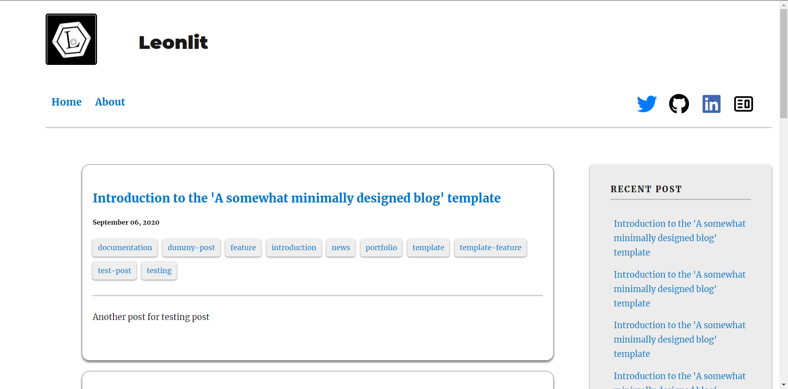
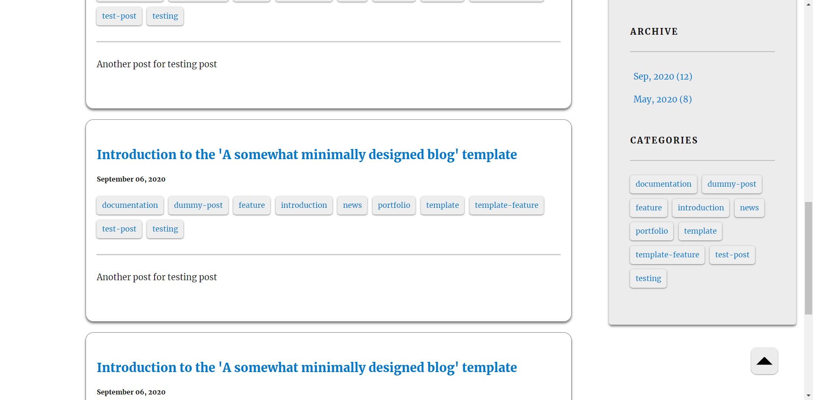
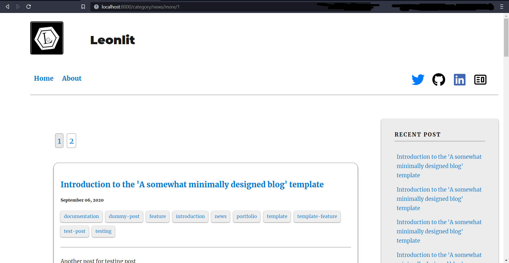

## Welcome

So after fixing and changing some of the content of the Gatsby site, finally I can publish this blog as a real blog.

*Homepage sample*

The blog already has some features like show blogpost by categories and month of a year in its previous version. In this new version, those features are extended to show more posts without flooding a single page with them. This extended version will show a "more" button if there's more page related to the page the users are viewing. Once they press the button, they'll be redirected to another page that will show more of the posts regarding the previous page (posts, categories or by the archive).

*Viewing more posts by categories or archive*

*Navigating between different pages for blog posts, posts by categories and by month*

*More posts by a category*

*More posts by a month*

Not only new features are added to this new version. I smashed a lot of bugs and fixed unexpected behaviours of some components from the previous version.

## Wait. Your new blog?

Yes, when I said it's my new blog, I meant that I actually have another <a href="https://devtavern.blogspot.com/" target="_blank" rel="noreferrer">old blog</a>, which I once "regularly" posted articles on. During the Covid-19 pandemic, I felt like writing some articles on programming. A hobby that I enjoy. I was working on a series to teach Java to my readers, targetting beginners. But ever since my University classes began to start back, I have had less and less time to write more posts, which resulted in the blog being dormant for like two years. But, I've determined one thing when I created this new blog. I will finish the Java tutorial series at the old blog (the blog is hosted on Blogger). 

## So, what is the target audience for this blog?

Well, actually, I did not plan for a fixed type of audience to write my blog for. My blog posts will range from programming, cyber security and development. After joining a class on security and discovering malware analysis, I have been interested in researching how those malware works. Therefore, the new blog might have some posts on malware analysis later on. 

## So, what now?

Now that the blog foundation is finished, I will be publishing articles once or twice every two weeks. They might change in the future, but I will try to write at least one post per month.